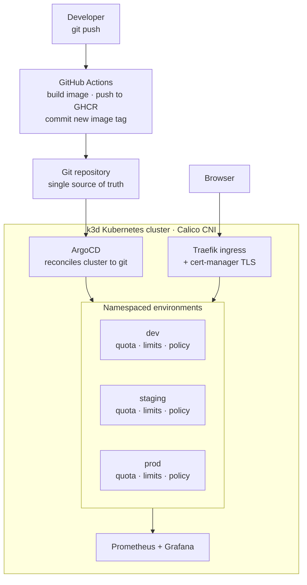

# Internal Developer Platform (IDP)

A self-service Kubernetes platform where a developer pushes code and the platform builds it,
deploys it across isolated environments, monitors it, and enforces resource and network
guardrails — with no tickets, no hand-written YAML, and no manual deploy steps.

Built solo as a hands-on platform-engineering project. Runs entirely locally at zero cloud cost.

**Stack:** k3d · Kubernetes · Calico · ArgoCD · Kustomize · Helm · cert-manager · Traefik ·
Prometheus · Grafana · GitHub Actions · GHCR · Go · Docker

---

## What it does

| Capability | How |
|---|---|
| **Multi-tenant isolation** | `dev` / `staging` / `prod` namespaces with ResourceQuotas, LimitRanges, and enforced NetworkPolicies |
| **GitOps delivery** | ArgoCD app-of-apps — git is the single source of truth; drift self-corrects |
| **CI/CD** | GitHub Actions builds a container image, pushes to GHCR, and commits the new image tag back to git; ArgoCD deploys it |
| **Observability** | Prometheus + Grafana, themselves deployed via GitOps |
| **Reproducibility** | One script + one `kubectl apply` rebuilds the entire platform from git — tested by destroying and rebuilding the cluster |
| **Automated TLS** | cert-manager issues and renews certificates |

## Architecture



**The flow:** a code push triggers CI, which builds an image and writes its commit-SHA tag back
into the deployment manifest in git. ArgoCD sees the change and reconciles the cluster to match.
CI never touches the cluster — it only updates git — so the pipeline needs no cluster credentials
and the cluster can never silently drift from what's committed.

## Engineering highlights

Rather than a feature list, these are the problems that took real debugging:

**Diagnosed a partial NetworkPolicy implementation.** Policies appeared to work but same-namespace
traffic was blocked. Controlled experiments across three rule formulations proved k3s's default
policy controller enforces `deny` rules but silently ignores `allow` rules. Migrated to Calico on
a feature branch and verified enforcement with a before/after test.
→ [ADR 0003](docs/decisions/0003-migrate-to-calico-for-networkpolicy.md)

**Found a workload misconfiguration through observability.** A Grafana panel showing "no data"
turned out to be correct behaviour — it exposed that pods in one namespace had no resource requests
(BestEffort QoS), caused by a sync-ordering race where pods were created before the LimitRange
existed. Fixed by setting requests explicitly rather than depending on injection order.

**Proved reproducibility by destroying the cluster.** Rebuilding from git surfaced three real bugs
that a running cluster never would have: an ordering dependency (cert-manager installed before the
CNI was ready), non-idempotent bootstrap scripts, and readiness timeouts too short for cold image
pulls. All fixed; the rebuild now works end-to-end.

**Eliminated a class of silent deployment errors.** Manually pinning image tags meant hand-mapping
commits to images — and pinning a *valid but wrong* SHA deploys stale code with no error anywhere.
Automating the tag update from CI's own build output removed the failure mode entirely.

The full build journal, including the wrong turns, is in [`docs/devlog.md`](docs/devlog.md).

---

## Running it locally

**Prerequisites:** Docker Desktop, `kubectl`, `k3d`, `helm`, `git`. Allocate at least 8 GB to Docker.

```bash
git clone https://github.com/VanshAgarwal11/internal-dev-platform.git
cd internal-dev-platform
./scripts/bootstrap-all.sh
```

That single script creates the cluster, installs Calico → cert-manager → ArgoCD (waiting on real
readiness conditions between each), then applies the root ArgoCD Application. ArgoCD takes over and
reconciles everything else — namespaces, quotas, network policies, both applications, and the
monitoring stack — from git.

The scripts are idempotent: if a step fails (slow network, a cold image pull), re-run the same
command and it resumes rather than erroring.

**Access ArgoCD:**

```bash
kubectl port-forward svc/argocd-server -n argocd 8081:443
kubectl -n argocd get secret argocd-initial-admin-secret \
  -o jsonpath='{.data.password}' | base64 -d
```

Then open `https://localhost:8081` (user `admin`).

**Access Grafana:**

```bash
kubectl port-forward svc/monitoring-grafana -n monitoring 3000:80
```

Then open `http://localhost:3000` (user `admin`, password `admin`).

**See the CI/CD loop work:** edit the message in `apps/greeter/src/main.go`, commit, and push.
CI builds a new image, commits the new tag, and ArgoCD deploys it — end to end in roughly ten
minutes with no further action.

## Repository layout

```
apps/                 applications (source, Dockerfile, Kustomize base + overlays)
  greeter/            Go service — built by CI, deployed via GitOps
  hello/              demo app deployed across all three environments
platform/
  environments/       namespaces, quotas, limit ranges, network policies
  argocd/             root Application + child Applications (app-of-apps)
  cert-manager/       ClusterIssuer
clusters/             k3d cluster configuration
scripts/              idempotent bootstrap scripts
docs/
  devlog.md           build journal — what broke and what I learned
  decisions/          architecture decision records
.github/workflows/    CI pipeline
```

## Design decisions

Recorded as ADRs in [`docs/decisions/`](docs/decisions/):

- [0001](docs/decisions/0001-use-k3d-for-local-cluster.md) — k3d for the local cluster
- [0002](docs/decisions/0002-namespace-per-environment-isolation.md) — namespace-per-environment isolation
- [0003](docs/decisions/0003-migrate-to-calico-for-networkpolicy.md) — migrate to Calico for NetworkPolicy enforcement
- [0004](docs/decisions/0004-cicd-github-actions-ghcr-gitops.md) — CI/CD via GitHub Actions + GHCR with GitOps deployment

## Known limitations

This is a learning platform, not a production system. Deliberate trade-offs:

- **ArgoCD polls git** (~3 min interval) rather than receiving webhooks, because a local cluster
  has no public endpoint for GitHub to call. In production a webhook would cut sync latency to
  seconds; a tunnel like ngrok would work locally but only while the tunnel is up.
- **Alertmanager is disabled** and no custom alert rules are written — the full monitoring stack
  is the heaviest tenant and this keeps the platform inside an 8 GB Docker allocation.
- **Self-signed certificates.** cert-manager is wired to a self-signed ClusterIssuer; the mechanism
  is identical to production, but a public CA like Let's Encrypt needs a real domain.
- **Single-node-equivalent cluster.** k3d's three "nodes" are containers sharing one host, so node
  allocatable figures over-report available capacity — quotas are sized against real shared capacity.
- **CI commits to `main`**, so local work must be rebased on the bot's commits. ArgoCD Image Updater
  would avoid this but costs cluster memory; the trade-off was made deliberately.
- **`greeter` is deployed to `dev` only**; `hello` spans all three environments.

---

Built by Vansh Agarwal · [LinkedIn](www.linkedin.com/in/vansh-agarwal-a95481294)